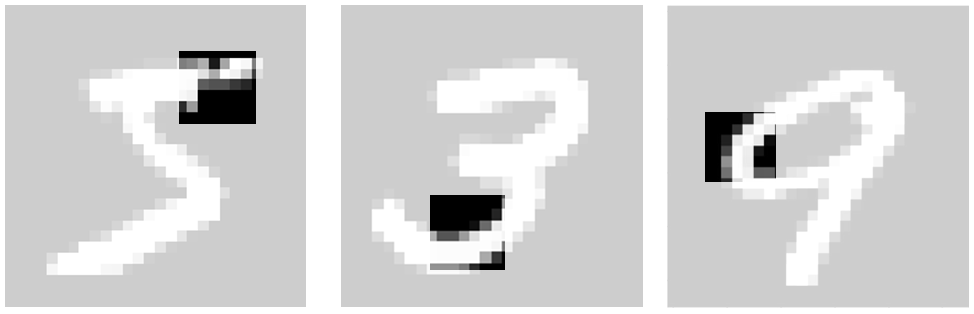

# Iterative Guided Flow Matching for Inverse Problems

This repository implements a Stochastic Expectation-Maximization (SEM) framework for learning a generative prior $P(X)$ from incomplete observations $Y$.

  

## Overview

The goal is to learn the distribution of a high-dimensional signal $X$ (e.g., a full image) when we only have access to a degraded or partial measurement $Y = f(X)$ (e.g., a crop, a projection, or a blurred image). Since we never observe the ground-truth $X$, the model learns by iteratively "hallucinating" reconstructions and then training on those "hallucinations."

## The Training Loop

The algorithm alternates between a Sampling Phase (Inference) and a Learning Phase (Optimization).
### Phase 1: Guided Sampling (The "E-Step")
Goal: Generate a "full" pseudo-image $\hat{X}$ that is consistent with the observed crop $y$.
1. Initialize: Start with a latent state of pure Gaussian noise $X_1 \sim \mathcal{N}(0, I)$.
2. Solve the ODE (Backwards $t=1 \to t=0$):  
   For each discrete timestep $t$ in the ODE trajectory:
   - Predict Velocity: Compute the current velocity using the model:  
   
$v = v_\theta(X_t, t)$

   - Step Toward Data: Move the current state toward the clean manifold:  
   
$X_{t-\Delta t} = X_t - \Delta t \cdot v$

   - Apply Manifold Guidance (The GPS): Correct the trajectory so the cropped region matches the real observation $y$ using the gradient of the forward loss:  
   
$X_{t-\Delta t} = X_{t-\Delta t} - \eta \nabla_{X} \|f(X_{t-\Delta t}) - y\|^2_2$
   
   (Where $\eta$ is the guidance scale/step size).
3. Final Result: At $t=0$, we obtain a reconstructed candidate $\hat{X}$ that satisfies the physical constraint $f(\hat{X}) \approx y$.

### Phase 2: Flow Matching (The "M-Step")

Goal: Update the model $v_\theta$ to treat the generated $\hat{X}$ as the new ground truth.
1. Sample Time: Select a random timestep $t \in [0, 1]$.
2. Construct Noisy State ($X_t$): Create an interpolation between the reconstructed image $\hat{X}$ and a new noise sample $X_1$:  
   
$X_t = (1-t)\hat{X} + t X_1$

3. Define Target Velocity: The ideal vector $u$ that maps the noise back to the image is:  

$u = X_1 - \hat{X}$

4. Optimize: Update the weights of the velocity network by minimizing the Flow Matching objective:  

$\mathcal{L} = \|v_\theta(X_t, t) - u\|^2_2$

 
 

By repeating these two phases, the model experiences a "self-correction" loop.In the beginning, the Guidance does the heavy lifting, forcing the noise to at least contain the correct crop $y$. Over many iterations, the Flow Matching model learns the common patterns across all various crops in the dataset, eventually recovering the full global prior $P(X)$ without ever seeing a complete original image.

