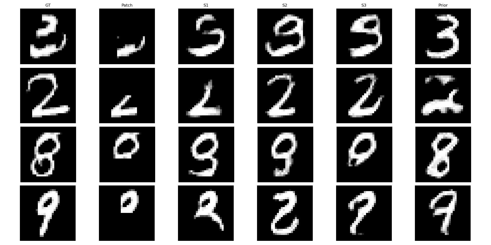
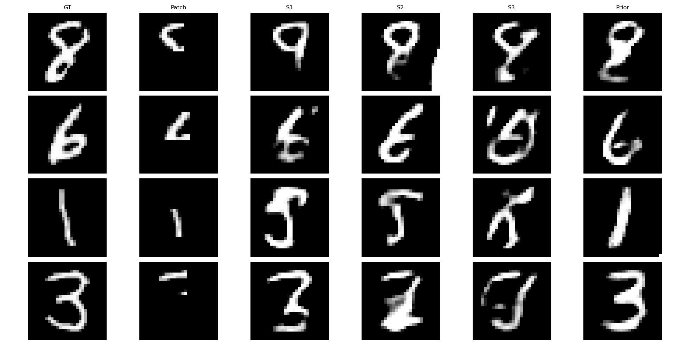
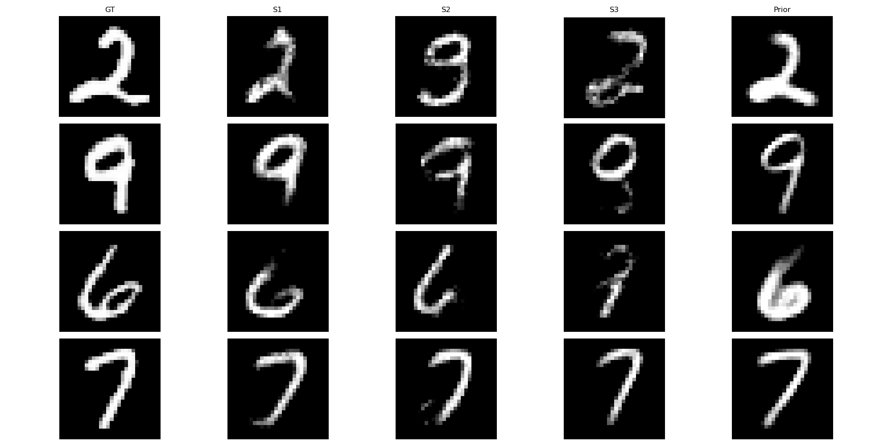

# Iterative Guided Flow Matching for Inverse Problems

This project implements Iterative Guided Flow Matching for conditional image completion on the EMNIST dataset. The model learns to generate full-image digits that are topologically consistent with a randomly sampled mxm observation patch.

  

## Overview

The goal is to learn the distribution of a high-dimensional signal $X$ (e.g., a full image) when we only have access to a degraded or partial measurement $Y = f(X)$ (e.g., a crop, a projection, or a blurred image). Since we never observe the ground-truth $X$, the model learns by iteratively "hallucinating" reconstructions and then training on those "hallucinations."

## The Training Loop

The algorithm alternates between a Sampling Phase (Inference) and a Learning Phase (Optimization).
### Phase 1: Guided Sampling (The "E-Step")
Goal: Generate a "full" pseudo-image $\hat{X}$ that is consistent with the observed crop $y$.
1. Initialize: Start with a latent state of pure Gaussian noise $X_1 \sim \mathcal{N}(0, I)$.
2. Solve the ODE (Backwards $t=0 \to t=1$):  
   For each discrete timestep $t$ in the ODE trajectory:
   - Predict Velocity: Compute the current velocity using the model:  
$v = v_\theta(X_t, t)$

   - Step Toward Data: Move the current state toward the clean manifold:   
$X_{t+\Delta t} = X_t + \Delta t \cdot v$

   - Apply Manifold Guidance: Correct the trajectory so the cropped region matches the real observation $y$ using the gradient of the forward loss:  
   
$X_{t-\Delta t} = X_{t-\Delta t} - \eta \nabla_{X} \|f(X_{t-\Delta t}) - y\|^2_2$
   
   (Where $\eta$ is the guidance scale/step size).
4. Final Result: At $t=1$, we obtain a reconstructed candidate $\hat{X}$ that satisfies the physical constraint $f(\hat{X}) \approx y$.

### Phase 2: Flow Matching (The "M-Step")

Goal: Update the model $v_\theta$ to treat the generated $\hat{X}$ as the new ground truth.
1. Sample Time: Select a random timestep $t \in [0, 1]$.
2. Construct Noisy State ($X_t$): Create an interpolation between the reconstructed image $\hat{X}$ and a new noise sample $X_0$:  
   
$X_t = (1-t) X_0 + t \hat{X}$

3. Define Target Velocity: The ideal vector $u$ that maps the noise back to the image is:  

$u = \hat{X} - X_0 $

4. Optimize: Update the weights of the velocity network by minimizing the Flow Matching objective:  

$\mathcal{L} = \|v_\theta(X_t, t) - u\|^2_2$

 
 

By repeating these two phases, the model experiences a "self-correction" loop.In the beginning, the Guidance does the heavy lifting, forcing the noise to at least contain the correct crop $y$. Over many iterations, the Flow Matching model learns the common patterns across all various crops in the dataset, eventually recovering the full global prior $P(X)$ without ever seeing a complete original image.

### Classifier-Free Guidance (CFG)

To achieve both diversity and high visual fidelity, the model implements CFG:
- Label Dropout: During training, 10% of class labels are replaced with a "null" token (Index 10).
- Sampling: At inference, the model extrapolates between the unconditional (null) prediction and the conditional prediction:  
  
$v_{cfg} = v_{uncond} + \text{cfg\_scale} \cdot (v_{cond} - v_{uncond})$

- Result: High CFG scales (3.0+) produce sharp, prototypical digit shapes, while the null token allows the model to explore multiple digit classes that could realistically fit the provided patch.

## Results
The following figures demonstrate the model's ability to complete digits based on localized 10x10 and 14x14 patches.

Patch Size 14:

  

  

  
</p

