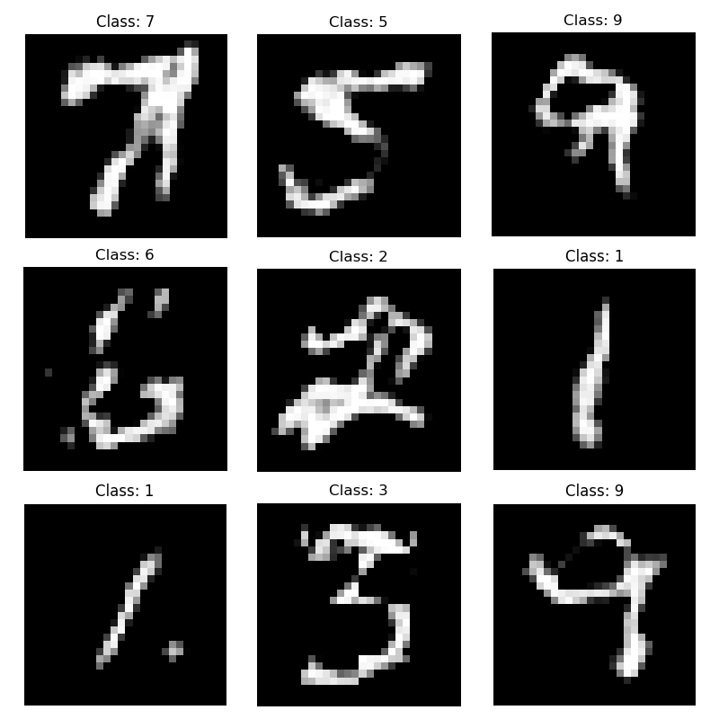
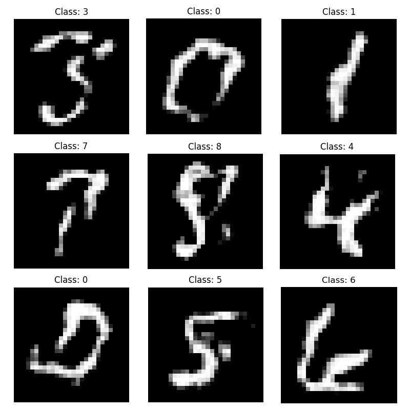

# PatchFlow: Coordinate-Conditioned Patch Flow Matching

A generative model that synthesizes $28 \times 28$ images by predicting the velocity of local $7 \times 7$ patches. 

This project explores the boundary between local patch-based training and global structural coherence using **Flow Matching**.

<p align="center">
  
</p>


## 🧠 The Concept

Unlike standard generative models that process the entire image at once, **PatchFlow** treats an image as a collection of independent patches. 

The model learns a vector field $v(x, t)$ that pushes random noise toward a data distribution. To ensure that 16 (or more) independent patches can "stitch" together to form a coherent digit, we use two critical synchronization signals:

1. **Spatial "GPS" (Fourier Features):** High-frequency sinusoidal embeddings of $(x, y)$ coordinates that allow the model to know exactly where a patch sits on the canvas.
2. **Global Class Signal:** A shared class embedding that ensures all patches are "sculpting" the same digit simultaneously.

## 🚀 Key Features

* **Flow Matching API:** Implements linear probability paths for efficient generative modeling.
* **Coordinate-Aware MLP:** Uses Random Fourier Features with a scale of 20.0 to capture sharp edge details.
* **ResNet Backbone:** Deep MLP with residual connections and SiLU activations to map complex vector fields.
* **Seamless Inference:** * **Global Noise Mapping:** Shared $x_0$ noise across overlapping patches to ensure structural harmony.
  * **Gaussian Blending:** Weighted averaging of overlapping patches to eliminate grid-boundary artifacts.
  * **Range Normalization:** Optimized for $[-1, 1]$ pixel space for symmetric gradient flow.

## 🛠 Usage

### Training
To start training from scratch:
```bash
python main.py --mode train --n_epochs 1500 --patch_size 7 --lr 5e-4 --overlap
```

### Inference / Evaluation
To generate a grid of samples from a specific checkpoint:
```bash
python main.py --mode eval --ckpt_path path/to/last_model.pt --overlap --fm_steps 64
```

## 📊 Technical Specifications

| Parameter | Value |
| :--- | :--- |
| **Patch Size** | 7x7 |
| **Coordinate Embedding** | Fourier (Scale: 20.0) |
| **Activation** | SiLU (Swish) |
| **Pixel Range** | [-1, 1] |
| **Inference Stride** | 2 (with overlap) |
| **ODE Solver** | Euler (64 steps) |


## Samples

 

